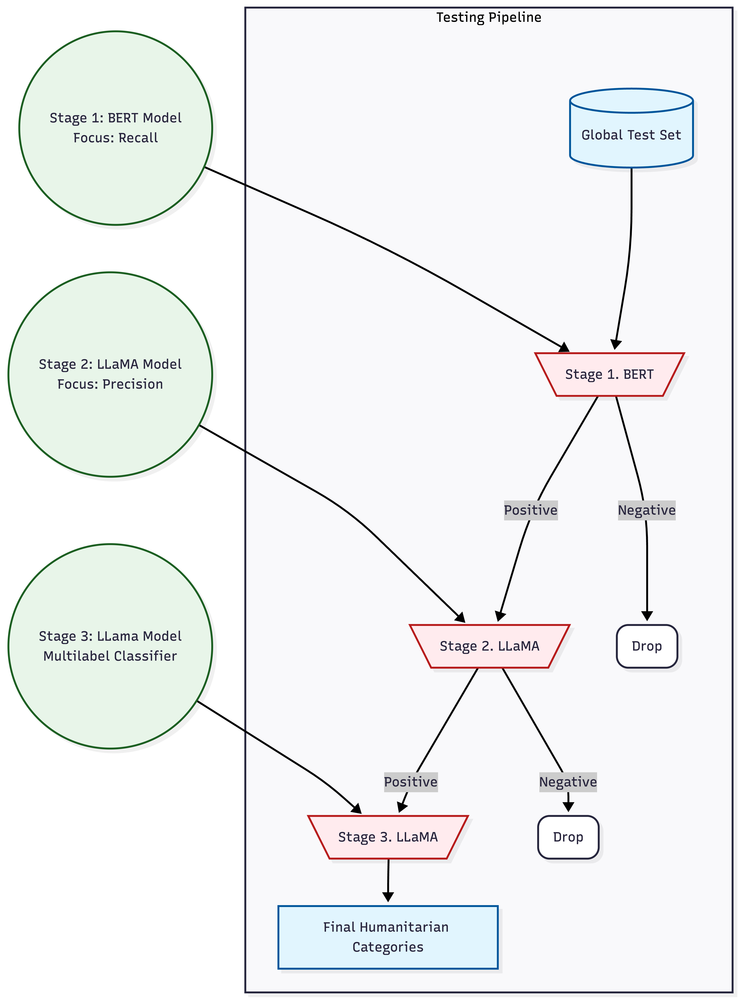

# Hi, I'm Ned 👋

I am a Senior Software Engineer and Artificial Intelligence Expert. I am looking for interesting and challenging projects that allow me to use state-of-the-art technology.

Alongside my academic background, I hold an MSc in Artificial Intelligence from the University of Auckland and an MEng in Computer Science from Vietnam National University. I love building products with speed, powered by a strong foundation.

# Projects 

I love coding and building. Love to share some of my projects below:

## [CrisisLiveTxt Dataset](https://github.com/dhnhut/CrisisLiveTxt-Dataset)

An AI for Good Project.

I create a dataset for Humanitarian Detection and Classification that simulates real-world scenarios by combining informative records with a significant amount of noise. This will be supported by a multi-stage pipeline of large language models (LLMs) designed to filter out valuable information obscured by the noise. Here are some quick highlights:

- I collected ~3.6 million records to simulate a real-world scenario in Humanitarian Detection.
- Apply Semantic Semilarity Searching using [FAISS](https://github.com/facebookresearch/faiss)
- Build a cascade classifier (multi-stage) to tackle the challenge effectively and efficiently by leveraging popular LLMs.
- Fine-tuning [BERT](https://huggingface.co/docs/transformers/en/model_doc/bert) for binary classification
- Fine-tuning [Llama. 3.2-3B-base](https://huggingface.co/zai-org/GLM-5.2), using [Quantized Low-Rank Adaptation (QloRA)](https://github.com/artidoro/qlora), a [Parameter-Efficient Fine-Tuning (PEFT)](https://huggingface.co/docs/peft/en/index)
- Apply Advanced Imbalancing handing, i.e., [FocalLoss](https://ieeexplore.ieee.org/document/8417976) and [WeightedLoss](https://docs.pytorch.org/docs/2.12/generated/torch.nn.CrossEntropyLoss.html).
<!--  -->

<!-- ## [SeaTurtle-ReID](https://github.com/dhnhut/SeaTurtle-ReID)

- I'll describe it soon.

## [Landslide-DeepLearning](https://github.com/dhnhut/Landslide-DeepLearning)

- I'll describe it soon. -->
